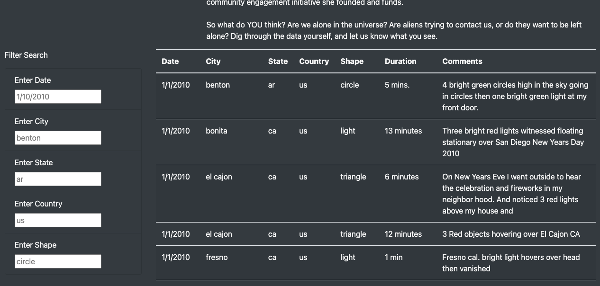

# UFOs

## Overview of the Analysis

The following deliverable has been created for the purpose of displaying and organizing a large amount of data related to UFO-related events and sightings.

### Purpose

In addition to the detailed information and introductory article, filters have been created to assist users with easily navigating through this incredibly vast amount of UFO-related events and sightings.

## Results 
 
- Improvements (Addition of Specified Search Filters):
    * This data will now be more accessible for individuals searching for specific UFO-related events with the addition of City, State, Country, and Shape filters. 

    (Once the Filter Button was removed, I was no longer able to filter search through the data. I can not identify the culprit and have re-written the code three times.)

## Summary

- One drawback of the current website version:

    * There is such an immense amount of data that it is difficult to visually identify trends.
    
- Two recommendations for future improvements:

    * Including a visual representation of events per day/month/year (ie, map or graph) to help establish trends, if any are present.
        
    * Improving filter fields so that they are no longer case sensitive and will pull results for approximate matches.
